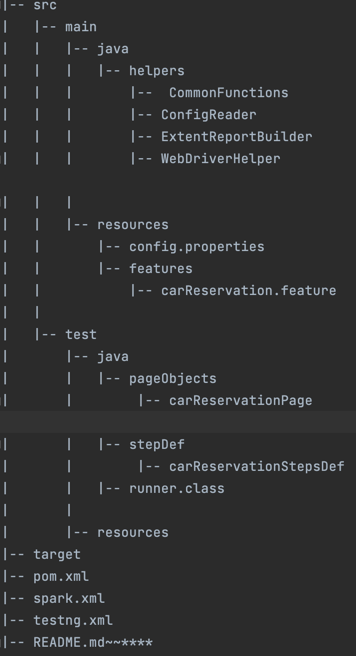

# syarah
 This is a mvn automation project  , to automate a reservation functionality on syarah website within both languages ar and en 

**Prerequisites**
Before you begin, ensure you have met the following requirements:

- Java JDK installed
- Maven installed

**Installation**
- Clone the repository.
- Navigate to the project directory

**Configuration**
Update the configuration files as needed (in case you need to verify the case using ar or en , you just need to change the link )
config.properties: Update any configuration properties such as env.url or other environment-specific details.
Usage

To run the tests, use the following Maven command:

`mvn clean test -DsuiteXmlFile=testng.xml`

**Test Reports**
After running the tests, you can find the HTML test report in the  `spark.html` file.

**Project Structure**
  

